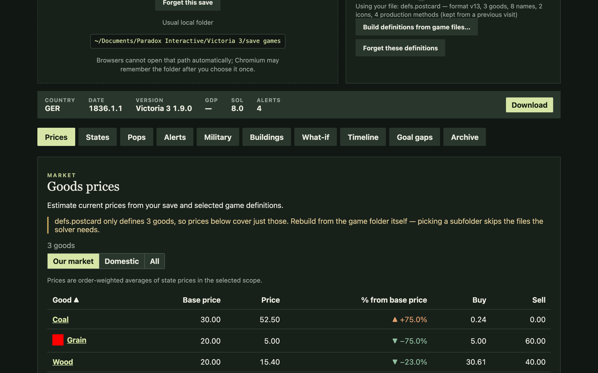

# Victoria 3 Analyzer & Planner

> Privacy-first, offline economic solver, what-if simulator, and AI strategic co-pilot for Victoria 3.

[](LICENSE)
[](https://github.com/jmalicki/vic3-analyzer/actions)

**Victoria 3 Analyzer** is an offline second-screen companion for *Victoria 3* (`.v3` save files). It solves true market price equilibria, diagnoses regional economic bottlenecks, checks strategic readiness, and finds optimal action timelines to achieve national goals.



---

## 🎮 How This Enhances Your Victoria 3 Campaign

Victoria 3 gives you immense freedom, but managing a 19th-century industrial empire comes with complex feedback loops and decision paralysis. `vic3-analyzer` acts as your personal chief economic advisor and strategic staff:

- **Avoid the Construction Trap (No More Blind Queueing):** In-game, queuing 10 Steel Mills can quietly spike input iron/coal prices to +75% and crash steel prices to -75% two years later, rendering the factories unprofitable. **What-If Previews** let you simulate the exact market and state-level price equilibrium before spending construction points.
- **Solve Qualification Deadlocks:** Wondering why your chemical plant won't hire despite high unemployment? The tool audits local pop literacy, wealth, and existing professions to give actionable promotion advice (e.g. *"Build a University here: you have high-literacy Machinists ready to promote to Engineers; building farms won't help"*).
- **Never Botch War Mobilization:** Before launching a diplomatic play for Alsace-Lorraine or the Congo, check your **Readiness Gaps**. The planner verifies strategic interest, troop numbers, munitions price stability, and debt runway under war mobilization so you don't default mid-war.
- **Optimize Production Methods (PMs):** When researching new techs (like Atmospheric Engines or Fertilizer), test which PM combinations maximize revenue, productivity, or Standard of Living across your states without triggering severe domestic shortages.
- **AI Strategic Co-Pilot (via MCP):** Connect an LLM (such as Claude Desktop or Cursor) to your campaign as an autonomous Chief of Staff. You can chat in natural language (*"Why is my weekly balance dropping?", "Am I ready to declare war on Austria?", "Simulate switching to Bessemer steel"*), and the AI executes real-time queries and what-if solves directly against your save.
- **Zero Friction & 100% Offline Privacy:** Keep it open in a browser tab or native desktop window. Your save files, token maps, and campaigns are parsed locally and **never uploaded**.

---

## 🌐 Three Ways to Run

### 1. In-Browser Web App (Zero Install)
* **Live Demo:** [https://jmalicki.github.io/vic3-analyzer/](https://jmalicki.github.io/vic3-analyzer/)
* Drag and drop your `.v3` save and your local `Victoria 3/game` folder.
* **100% Client-Side:** Everything parses and solves locally inside your browser via WebAssembly (`wasm-bindgen`) and IndexedDB. Saves, definitions, and tokens are **never uploaded** to any server.

### 2. AI Strategic Co-Pilot (Claude Desktop / Cursor via MCP)
* Turn Claude Desktop, Cursor, or your favorite AI assistant into your personal Grand Strategy advisor using the [Model Context Protocol (MCP)](docs/mcp.md).
* Connects seamlessly to your desktop AI tools via standard local process communication (no web servers or open network ports required).
* The AI can automatically discover your autosaves, explain domestic shortages, run analytical queries, and preview what-if economic adjustments in real time:
  ```json
  {
    "mcpServers": {
      "vic3-analyzer": {
        "command": "cargo",
        "args": ["run", "-p", "vic3-analyzer", "--", "mcp"]
      }
    }
  }
  ```

### 3. Native Desktop Companion (Tauri 2 GUI)
* Standalone desktop application with auto-discovery of local Steam installs and save directories across macOS, Windows, and Linux.
* Includes an interactive campaign dashboard, save timeline browser, and what-if simulation tools.
* Run locally:
  ```bash
  cargo run -p vic3-analyzer
  ```

---

## ✨ Core Capabilities

- **Market Equilibrium & MAPI Pricing:** Computes relative market prices and per-state blended prices considering pop wealth, substitution shares, and infrastructure access.
- **What-If Economic Simulator:** Test building expansions and production method (PM) switches with instant re-solved price previews before committing in-game.
- **Strategic Goal Planning:** Evaluate readiness gaps and generate step-by-step action sequences for goals such as `declare-war(state=alsace)`, `gdp >= 100M`, `research(tech=nitroglycerin)`, and credit solvency.
- **Bottleneck Diagnostics & Qualification Advice:** State-by-state pop employment shortage detection with contextual promotion feeder advice (e.g. promoting high-literacy machinists to engineers via universities).
- **Privacy & Asset Safety:** All game parsing is local. No proprietary Paradox game files, textures, or binary token maps are redistributed.

---

## 📚 Documentation

### Player & Methodology Guides
| Document | Description |
| --- | --- |
| [Desktop Companion](docs/desktop.md) | Tauri companion setup, Steam save auto-discovery, and settings |
| [Goal Planning DSL](docs/dsl.md) | Goal language grammar, predicates, and expansion rules (`declare-war`, `colonize`) |
| [Save History & Timelines](docs/archive.md) | Local save archive, timeline branching, and plan comparison |
| [Price Equilibrium Methodology](docs/prices.md) | Non-linear solver, MAPI formulas, pop need packages, and solver caveats |
| [Strategic Planning Engine](docs/planning.md) | State representation, search heuristics, and payday debt model |

### 🛠️ Developer & Contributor Documentation
For local build instructions, test workflows, crate architecture, CLI tools, MCP integration, DataFusion SQL tables, JSON schemas, and mathematical invariants, see the **[Contributor & Developer Guide](CONTRIBUTING.md)**.

---

## 📄 License

This project is licensed under [AGPL-3.0](LICENSE).  
*Victoria 3 is a trademark of Paradox Interactive AB. This project is not affiliated with or endorsed by Paradox Interactive.*
