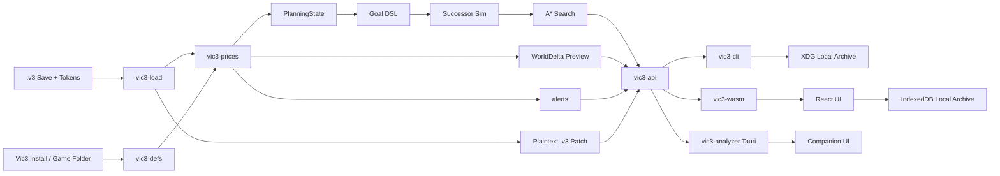

# Architecture & Crate Design

**vic3-analyzer** is structured as a modular workspace of Rust crates, a WebAssembly bridge, a Vite/React frontend, and a native Tauri companion.

The core analysis engine is transport-independent: analytical results and option structs are shared identically across the CLI, Web UI, Desktop GUI, and MCP server.

---

## Crate Responsibilities

| Crate | Responsibility | Dependencies / Target |
| --- | --- | --- |
| **`vic3-load`** | Parsing `.v3` save files (using `jomini` and `pdx-tools` `vic3save`) into intermediate representation (`WorldSave`); surgical plaintext patch export (`SavePatch`). | Pure Rust, WASM-safe |
| **`vic3-defs`** | Extracting and indexing game definitions (goods, PMs, pop needs, buy packages) from installs or precompiled blobs; decoding game UI icons. | Pure Rust, WASM-safe |
| **`vic3-prices`** | Market price equilibrium solver (Basin non-linear least squares + successive substitution warm start), pop consumption, [MAPI](https://vic3.paradoxwikis.com/Market#Market_access_price_impact) blending, and qualification bottleneck alerts. | Pure Rust, WASM-safe |
| **`vic3-planning`** | Compact `PlanningState` projection, Goal DSL parsing (`chumsky`), goal-relevant successor generation, and A* search engine (`rust-advanced-heaps`). | Pure Rust, WASM-safe |
| **`vic3-api`** | Transport-free API facade. Accepts raw bytes or filesystem paths and produces uniform analytical JSON. | Pure Rust |
| **`vic3-catalog`** | File system discovery and watcher for local/Steam save directories and shared application configuration (`config.toml`). | Native OS |
| **`vic3-sql`** | Embedded read-only [Apache DataFusion](https://datafusion.apache.org/) SQL query engine over the save catalog and active save fact tables. | Native OS |
| **`vic3-mcp`** | Model Context Protocol server (`rmcp`) exposing query tools, campaign briefs, and prompts to desktop AI assistants. | Native OS |
| **`vic3-cli`** | Command-line interface (`clap`). Clap wrappers exist only in this crate; core structs remain filesystem-free. | Native CLI binary |
| **`vic3-analyzer`** | Fat desktop binary (Tauri 2). Default launch runs the GUI companion; `vic3-analyzer mcp` launches the headless MCP server. | Native Desktop binary |
| **`vic3-wasm`** | Thin `wasm-bindgen` wrapper exposing `vic3-api` functionality to browser JavaScript. | WebAssembly |
| **`web/`** | Browser client built with React and Vite. Uses IndexedDB for offline persistence and generates forms dynamically from JSON Schema. | Browser / Web |

---

## Data Flow Diagram

---

## Asset & Definition Pipeline

Game definitions and visual assets are processed completely offline without distributing proprietary Paradox assets:

1. **Path Allowlisting:** When reading a local game directory, [`vic3-defs`](../crates/vic3-defs) scans only essential paths: allowlisted `common/` directories (goods, production methods, pop types, technologies, laws), English localization (`*_l_english.yml`), and goods icons.
2. **Texture Decoding (DDS to PNG):** In-game icons are stored as DirectDraw Surface (`.dds`) textures with block compression. Browsers cannot render DDS natively. The [`vic3-defs::icons`](../crates/vic3-defs/src/icons.rs) pipeline decodes the top mip (supporting BC1, BC2, BC3, BC7, and uncompressed 32-bit RGBA) into raw pixel buffers and re-encodes them as compact PNG data URLs. Unrecognized or damaged textures degrade gracefully without interrupting the solve.
3. **Serialization Blob:** The extracted definitions and PNG icons are packed into a versioned `defs.postcard` blob. In the browser, this blob is saved to IndexedDB so subsequent visits load instantly.

---

## Shared Options & Schema Isolation

To ensure absolute consistency across CLI, WASM, Desktop, and MCP surfaces:
- **No Filesystem References in Core Option Types:** Inner structs (`SolveOpts`, `WhatIfOpts`, `PlanOpts`, `WorldDelta`) never contain `PathBuf` or OS-specific paths.
- **Unified Schemas:** Schemas are derived via `schemars` from shared serde types, guaranteeing that CLI flags, JSON outputs, and React UI form components adhere to the exact same data contracts.

---

## Search Engine Specifications

The A* planner uses priority queue pathfinding from `rust-advanced-heaps`:
- **Node Compaction:** The search node `N` implements `Clone + Eq + Hash` using lightweight `Arc<PlanningState>` references or compact state hashes to ensure minimal memory overhead during large graph expansions.
- **Consistent Admissible Heuristics:** The remaining time heuristic $h$ is computed from a relaxed dependency DAG of remaining goal conjuncts, ensuring admissibility and strict optimality under our model assumptions.

---

## Patch Export Safety

`export-save` modifies building production methods and levels directly in the **original uncompressed plaintext** stream:
- It surgically rewrites `building_manager.database` entries in-place.
- It rejects binary/ironman envelopes.
- It strictly enforces that the original save file is never overwritten, writing exclusively to the specified `--out` path.
