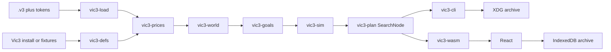

# Architecture

This tool is a **model** of Victoria 3, not the game binary. Plans are time-optimal under the formulas and invariants in these docs. They are not guaranteed to match Paradox’s executable.

License: AGPL-3.0. Saves and token maps are user-supplied and never uploaded.

## Delivery

1. **CLI** (`vic3-cli`) — first product. Load a `.v3`, print prices, what-if, gaps, plans as JSON or text.
2. **In-browser UI** (`web/` + `vic3-wasm`) — same Rust core, `wasm-bindgen`. Drop a save in the tab. No server, no upload.
3. **Local archive** — past runs and named alternative plans stay on the machine ([`archive.md`](archive.md)).

## Crates

| Crate | Role |
| --- | --- |
| `vic3-load` | Envelope via pdx-tools `vic3save` + our serde IR (`DeserializeVic3`) |
| `vic3-defs` | Goods, defines, PMs, pop needs from a game install or fixture tree; wasm defs blob |
| `vic3-prices` | Closed-form market price + pop consumption + Basin NLS equilibrium |
| `vic3-world` | Compact `PlanningState` projection from IR + prices |
| `vic3-goals` | Chumsky DSL + `declare-war` / `research` / `gdp` compilation |
| `vic3-sim` | Goal-relevant successors; event-wait edges |
| `vic3-plan` | `SearchNode` glue + `shortest_path`; shared option/result/archive types |
| `vic3-cli` | clap only lives here |
| `vic3-wasm` | Bytes in, JSON out; no filesystem |
| `web/` | Vite + React; IndexedDB archive; forms from JSON Schema |

Shared option structs (no `PathBuf`) live with results in `vic3-plan` (or a tiny sibling if that crate’s deps get too heavy). clap flatten wrappers in `vic3-cli` only. wasm never links clap.

## Data flow

Binary saves need a **user-supplied token map**. We do not redistribute Paradox tokens. Text saves do not need tokens.

## What we freeze

Employment, wages, hire/fire, and trade-center volumes are **frozen** except explicit what-if deltas (building levels, PMs, etc.). Pop consumption is **not** frozen: it sits in the price loop. See [`prices.md`](prices.md).

## Search

Do not write a third A*. Use `rust_advanced_heaps::pathfinding::{SearchNode, shortest_path}`. Node type `N` must be cheap (`Arc` or a compact hash), not a fat `PlanningState` as a HashMap key. See [`planning.md`](planning.md).

## Out of scope (this architecture)

- Fighting/winning the war (only starting the play)
- AI countries; labor market equilibrium; endogenous trade volumes
- Writing moves back into a save
- Server-side upload or cloud sync
