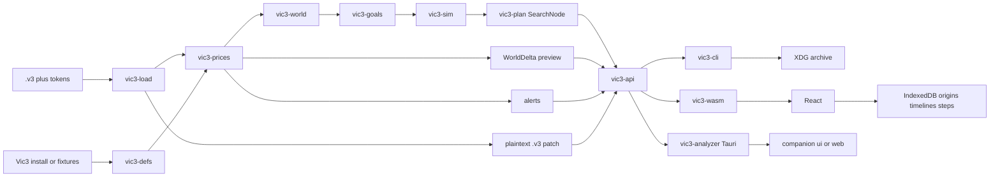

# Architecture

This tool is a **model** of Victoria 3, not the game binary. Plans are time-optimal under the formulas and invariants in these docs. They are not guaranteed to match Paradox’s executable.

License: AGPL-3.0. Saves and token maps are user-supplied and never uploaded.

## Delivery

1. **CLI** (`vic3-cli`) — first product. Load a `.v3`, print prices, what-if, alerts, WorldDelta preview, PM search, gaps, and plans as JSON or text. Patch-export writes a **new** plaintext `.v3`.
2. **In-browser UI** (`web/` + `vic3-wasm`) — same Rust core via `vic3-api`, thin `wasm-bindgen`. Drop a save in the tab. No server, no upload. Load solves prices immediately.
3. **Desktop** (`vic3-analyzer`) — one fat Tauri 2 binary: default argv opens a WebView; `vic3-analyzer mcp` runs stdio MCP via `vic3-mcp` / rmcp with an early argv branch (no window; WebView libs may still load). See [`desktop.md`](desktop.md), [`mcp.md`](mcp.md).
4. **Local archive** — past runs and named alternative plans stay on the machine ([`archive.md`](archive.md)). UI save timelines live in IndexedDB (`origins` / `timelines` / `steps` / `current`).

## Crates

| Crate | Role |
| --- | --- |
| `vic3-load` | Envelope via pdx-tools `vic3save` + our serde IR (`DeserializeVic3`); surgical plaintext `.v3` patch-export (`SavePatch`). Contracts in crate rustdoc. |
| `vic3-defs` | Goods, defines, PMs, pop needs from a game install or fixture tree; wasm defs blob. Contracts in crate rustdoc. |
| `vic3-prices` | Closed-form market price + pop consumption + Basin NLS equilibrium; `alerts`, `preview(WorldDelta)`, `warm_rel` |
| `vic3-world` | Compact `PlanningState` projection from IR + prices |
| `vic3-goals` | Chumsky DSL + `declare-war` / `research` / `gdp` compilation |
| `vic3-sim` | Goal-relevant successors; event-wait edges |
| `vic3-plan` | `SearchNode` glue + `shortest_path`; shared option/result/archive types |
| `vic3-api` | Transport-free analysis (bytes or paths in, JSON out); shared shapes for wasm, Tauri, MCP (and CLI `--json`) |
| `vic3-catalog` | Save-root scan (stubs, `local`/`steam_cloud`), shared TOML/JSON app config + path auto-detect |
| `vic3-sql` | Read-only DataFusion SQL over catalog + active/latest fact tables |
| `vic3-mcp` | Stdio MCP server (rmcp): tools `query` / `use_save` / `refresh_catalog` / `explain`, resources, prompts |
| `vic3-cli` | clap only lives here; commands map to the same analysis as `vic3-api` |
| `vic3-analyzer` | Tauri 2 desktop binary (`gui` / `mcp` argv); companion Settings/catalog/Advanced Query + links `vic3-mcp` / `vic3-api` / `vic3-sql` |
| `vic3-cli` | clap only lives here |
| `vic3-analyzer` | Fat Tauri 2 binary: default/`gui` → companion UI (incl. Advanced Query); `mcp` → stdio MCP (no window; early argv). Shares catalog config + defs cache with `vic3-mcp`. |
| `vic3-wasm` | Thin `wasm-bindgen` over `vic3-api`; no filesystem |
| `web/` | Vite + React; IndexedDB archive; forms from JSON Schema |

Shared option structs (no `PathBuf`) live with results in `vic3-plan` (or a tiny sibling if that crate’s deps get too heavy). clap flatten wrappers in `vic3-cli` only. wasm never links clap. Facades share `vic3-api` so JSON shapes stay identical.

## Data flow

Binary saves need a **user-supplied token map**. We do not redistribute Paradox tokens. Text saves do not need tokens.

## What we freeze

Employment, wages, hire/fire, and trade-center volumes are **frozen** except explicit what-if deltas (building levels, PMs, etc.). Pop consumption is **not** frozen: it sits in the price loop. See [`prices.md`](prices.md).

## Search

Do not write a third A*. Use `rust_advanced_heaps::pathfinding::{SearchNode, shortest_path}`. Node type `N` must be cheap (`Arc` or a compact hash), not a fat `PlanningState` as a HashMap key. See [`planning.md`](planning.md).

## Patch-export

`export_save` rewrites `building_manager.database` entries in the **original uncompressed plaintext** (zip `gamestate` or raw text). It does not round-trip the serde IR. Production methods and extra levels are applied in place; the origin bytes are never written. Ironman / binary envelopes are rejected. The CLI `export-save` command always writes `--out` and refuses to overwrite `--save`.

`mutate` applies a [`WorldDelta`](json-schema.md) to a cloned world and re-solves (`preview`). That preview does not write a file. `SolveOpts.warm_rel` feeds the previous relative-price vector into Basin so a second solve can skip successive substitution.

## Out of scope (this architecture)

- Fighting/winning the war (only starting the play)
- AI countries; labor market equilibrium; endogenous trade volumes
- Server-side upload or cloud sync
