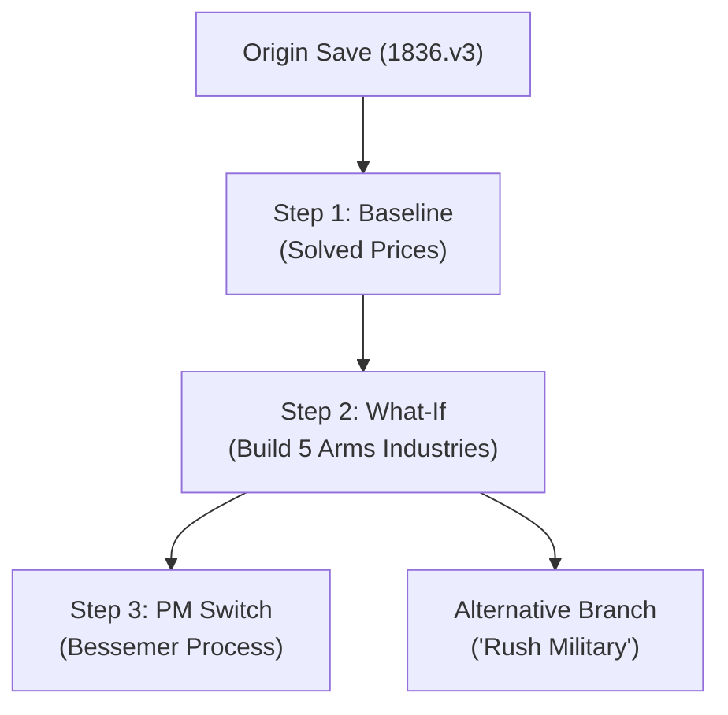

# Local Campaign Archive & Timeline Comparison

`vic3-analyzer` treats past saves, timeline branches, and **alternative strategic plans** as first-class citizens.

All campaign data, analysis records, and timeline steps are stored completely locally (via XDG directory on CLI/Desktop and IndexedDB in the browser). Nothing is ever uploaded.

---

## Save Timelines & Branching

Rather than treating saves as a flat list of disconnected files, `vic3-analyzer` organizes your campaign into an interactive branching timeline tree:



| Store | Role |
| --- | --- |
| **`origins`** | Immutable record of the original `.v3` save bytes, name, and cryptographic fingerprint. |
| **`timelines`** | Labeled branches on an origin save (e.g. `Main`, `Alternative Heavy Industry`). |
| **`steps`** | Sequential nodes on a timeline containing what-if mutations, cached price solves, and optional patched save bytes. |
| **`current`** | Active cursor pointer pointing to `{ origin_id, timeline_id, step_id }` so browser reloads restore your exact workspace. |

---

## Analysis Records (`AnalysisRecord`)

Analytical results (prices, what-if evaluations, readiness gaps, and action plans) are saved as structured records:

| Field | Description |
| --- | --- |
| `id` | Unique UUID |
| `created_at` | RFC 3339 timestamp |
| `label` | Optional custom label (e.g. `"Rush Munitions"`, `"Industrialize Silesia"`) |
| `kind` | `prices`, `what_if`, `gaps`, or `plan` |
| `fingerprint` | Cryptographic SHA-256 hash of the origin save bytes |
| `date` | In-game campaign date (e.g. `1836.1.1`) |
| `country` | Played country tag (e.g. `PRU`) |
| `opts` | Shared option struct used during the analysis |
| `result` | The exact JSON analysis result |
| `limitations` | Model caveats and convergence residual |

---

## Plan Comparison & Historical Diffing

You can compare any two analysis records to evaluate tradeoffs:
- **Same Fingerprint:** Compares alternative strategic plans for the same campaign moment.
- **Different Fingerprints:** Compares campaign progression over time.

### Diff Outputs
- **Plans:** Action sequence alignment, day cost differences, and queued techs/laws/buildings.
- **Prices:** Per-good price and shortage deltas ($\Delta \text{price}$, $\Delta \text{shortage}$).
- **Gaps:** Conditions cleared versus conditions still unsatisfied.

### CLI Comparison Commands
```bash
# List all archived analyses
vic3-cli archive list

# Inspect a specific analysis record
vic3-cli archive show <record-id>

# Diff two plans or price solves
vic3-cli archive diff <record-id-1> <record-id-2>
```
