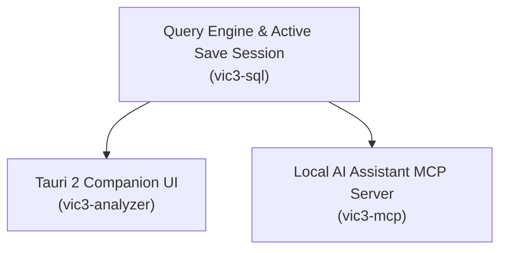

# Desktop App

The Vic3 Analyzer desktop app is a lightweight local application designed to run alongside Victoria 3. It automatically detects your active game saves, provides a real-time campaign dashboard, monitors economic shortages, and maps out goal progression timelines.

The compiled binary can run as either the **Desktop GUI** (default) or the background **AI Assistant MCP Server** (`vic3-analyzer mcp`).

---

## Launching the App

```bash
# Embed the web UI (relative asset base), then launch the desktop application
pnpm --filter web run build:desktop
cargo run -p vic3-analyzer

# Launch as a background AI assistant (MCP server)
cargo run -p vic3-analyzer -- mcp

# Headless CI ready check
./scripts/mcp-smoke.sh
```

`cargo run` loads the embedded `web/dist` (no Vite). Rebuild with
`build:desktop` after UI changes. GitHub Pages builds keep using plain
`pnpm --filter web run build` (`base: /vic3-analyzer/`).

*(For Linux prerequisites such as WebKitGTK 4.1, refer to the [Tauri prerequisites guide](https://v2.tauri.app/start/prerequisites/)).*

---

## Automatic Discovery Paths

On first launch (or when paths are unconfigured), `vic3-analyzer` automatically detects game installs and local save folders:

### 1. Game Definitions (`game/`)

| OS | Default Search Locations |
| --- | --- |
| **macOS** | `~/Library/Application Support/Steam/steamapps/common/Victoria 3/game` |
| **Windows** | `C:\Program Files (x86)\Steam\steamapps\common\Victoria 3\game` (and additional Steam library folders) |
| **Linux** | `~/.local/share/Steam/steamapps/common/Victoria 3/game`, `~/.steam/steam/steamapps/common/Victoria 3/game` |

*Validation:* The folder must contain a `common/` directory. When found, definitions are indexed and cached locally under application data.

### 2. Save Game Directories

| OS | Local Save Folder |
| --- | --- |
| **macOS** | `~/Documents/Paradox Interactive/Victoria 3/save games` |
| **Windows** | `%USERPROFILE%\Documents\Paradox Interactive\Victoria 3\save games` |
| **Linux** | `~/.local/share/Paradox Interactive/Victoria 3/save games` |

*Steam Cloud Saves (Optional):* `.../Steam/userdata/<user-id>/529340/remote/save games`.

---

## Configuration File

Settings are saved in your platform's local application data directory (`$XDG_DATA_HOME/vic3-analyzer/` on Linux/macOS or `%LOCALAPPDATA%\vic3-analyzer` on Windows) as `config.toml` (or `config.json`):

| Key | Type | Description |
| --- | --- | --- |
| `game_dir` | string (path) | Absolute path to the installed `Victoria 3/game` directory |
| `defs_blob` | string (path) | Optional path to a precompiled `defs.postcard` blob |
| `save_dirs` | array of paths | List of directories monitored for `.v3` save files |
| `tokens_path` | string (path) | Optional path to a token mapping file for binary Ironman saves |
| `auto_detect` | boolean | Automatically populate missing paths on startup (default `true`) |

---

## Architecture & Integration

The Desktop app integrates the query engine, save watcher, and MCP server directly on your local machine:



- **Shared Configuration:** The GUI and MCP server share the same configuration file and definition caches.
- **Save Watcher:** Monitors configured save directories with debouncing and automatically refreshes the catalog when a new autosave or manual save appears.
- **Privacy Guarantee:** The application only scans allowlisted save and Steam directories. It never transmits saves, telemetry, or system files over the network.

---

## Settings & Commands

The Desktop UI provides settings management and exposes the following internal Tauri commands:
- `get_config` / `save_config` / `reset_config`: Manage application settings.
- `list_saves` / `get_dashboard`: Fetch cataloged saves and summary campaign metrics.
- `use_save`: Bind an active save session for diagnostics and what-if simulation.
- `sql_query`: Execute read-only queries against the loaded save.
- `loaded_prices` / `loaded_alerts` / `loaded_gaps`: Retrieve cached analytical projections.

### Intentional UI differences vs the web app

The desktop and web apps share one React SPA, with a few deliberate differences:

| Concern | Web | Desktop (Tauri) |
| --- | --- | --- |
| Save / definitions input | Drop zone + folder → defs blob (browser-local) | **Saves** workspace lists disk catalog. Compact chip shows the loaded stub |
| Game folder | Built once via DefsBuilder | Auto-detected. Override in **Settings** |
| Heavy load | wasm worker | `use_save` / SQL run on a blocking pool (UI stays responsive) |
| Advanced Query | Not available | Native SQL engine |

Use **Saves** to pick a campaign. Use **Settings** when auto-detect is wrong. Paths are shared with `vic3-analyzer mcp` via `config.toml`.
