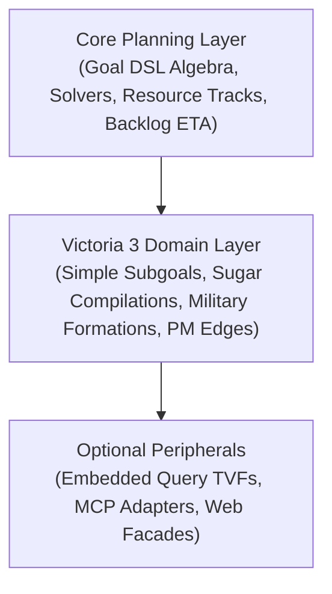

# Strategic Planning & A* Search Specification

This document details the state representation, graph transition operators, admissible heuristic bounds, and A* search engine in [`vic3-planning`](../crates/vic3-planning).

The planner evaluates goal predicates and discovers time-optimal action sequences (e.g. tech sequencing, law checkpoints, military barracks expansion, production method upgrades, and debt amortization).

### Terminology

A **simple subgoal** is a compiled goal node with no further goal children in the
current tree (`Goal::Simple` / `SimpleSubgoal` in Rust). Compound goals
(AND / OR / NOT) refine into **simple subgoal**s; future sugar may refine them
further — the name means “simple in this compile,” not forever irreducible.

---

## PlanningState Projection

A `PlanningState` is a compact, deterministic projection of the save file and the latest economic solve:

| Field | Source / Projection Logic |
| --- | --- |
| `date`, `country` | Game date and country tag from save metadata |
| `techs` | Acquired technology script IDs |
| `laws` | Active law script IDs |
| `infamy` | Current infamy level |
| `queued_tech` | In-flight active research project |
| `queued_building` | In-flight construction head (private or government) |
| `constructions` | Full ordered construction backlog |
| `good_prices`, `gdp` | Solved goods prices and gross output value from the economic model |
| `treasury`, `weekly_balance`, `debt_*`, `credit_*`, `solvent` | Country fiscal balance and credit headroom |
| `population_weighted_wealth` | Pop-weighted average wealth across owned states |
| `army_power_projection`, `navy_power_projection` | Projected military and naval strength from combat formations and staffing |
| `building_level_deltas`, `pm_overrides`, `tax_level` | Sim-only mutations along the branch (`(building_type, state_id)` level adds, PM overrides, tax offset) |
| `construction_rate` / `construction_points_per_day` | **Government** construction points/day (CS output × government share from economic laws) |

**Invariants:**
- **Deterministic State Hashing (I8):** Identical planning states produce identical hashes; applying an action is strictly deterministic.
- **Node Compaction:** The search node wraps `Arc<PlanningState>` or a compact hash to minimize memory footprint during priority queue expansions.

---

## Search Graph Operators

Transitions between states consist of **zero-day decisions** and **event-wait edges**:

### 1. Decision Edges (0 Days)
- `QueueTech`: Selects a tech that unlocks prerequisites for open simple subgoals.
- `QueueBuildingLevel`: Adds a level of a building type in a specific state (barracks, shipyards, or economic buildings).
- `SwitchPm`: Swaps production methods to boost GDP or relieve a specific goods shortage.
- `QueueLaw`: Begins a law passage checkpoint.
- `QueueInterest`: Declares a strategic interest in a target region.
- `AdjustTax`: Increments or decrements the tax level to meet weekly budget balance goals.

### 2. Event-Wait Edges (Advances Date)
- Advances the game clock to the earliest completion event: tech research finished, building construction complete, military training staffed, law enacted, interest established, or weekly payday debt reduction.
- **Invariant I6:** Event-wait edges strictly advance the game date ($\Delta t > 0$). No wait edge is generated if no action is in flight and solvency is not an open simple subgoal.

---

## A* Heuristics & Consistency

Search uses priority queue pathfinding (`SearchNode`, `shortest_path`) from `rust-advanced-heaps`, wrapped by a PEA* adapter ([`planning-search.md`](planning-search.md)):

- **Partial expansion:** domain successors are ranked by \(f-g\); only a fixed beam (16) is inserted per expand, with the parent re-queued via an expansion cursor.
- **Admissible Heuristic $h$:** Estimates remaining calendar days by relaxing the remaining goal conjuncts into a dependency DAG:
  - Open tech, interest, military training, and law simple subgoals contribute their minimum model durations.
  - Conjunctions (`AND`) take the maximum bound of parallelizable tracks.
  - Disjunctions (`OR`) take the minimum bound across alternatives.
  - Solvency, tax adjustments, and zero-day PM switches contribute zero days where immediate transitions exist.
- **Invariant I7:** On any valid dependency graph, $h$ never overestimates the true remaining days to goal satisfaction.

---

## Non-Tech Action Models

### 1. Compact Payday Model (Fiscal Goals)
- When `solvent`, `credit_headroom`, or `debt_principal` is an open simple subgoal, successors emit weekly payday waits (7 days).
- Surplus weekly balance pays down principal before accumulating cash; deficits draw down treasury before borrowing.
- Tax adjustments shift the weekly balance sample by discrete increments (`tax_balance_per_step`).

### 2. Military Power Projection
- Power projection is increased by constructing and staffing military infrastructure:
  - **Army:** `building_barracks` construction followed by training time (`army_training_days`).
  - **Navy:** `building_shipyards` and `building_naval_administration` followed by crew hiring (`navy_crew_days`).

### 3. Production Method Switching
- When an economy context is present, the planner evaluates candidate PM switches on relevant industries, applies the override, and triggers an immediate price re-solve.

### 4. Construction capacity (compact model)
- **Capacity** starts from `base_construction_capacity` and rises by Construction Sector levels × **required** CS PM `country_construction_add` from defs. Missing or invalid CS production methods are errors (no iron-frame-shaped per-level guess). Load and sync paths pass defs so PMs resolve the same way.
- **National pool only:** Victoria 3 does not allocate construction by geographic state. The planner models national throughput split into **government** vs **private** (`1 − country_private_construction_allocation_mult` from economic-system laws). Private queue rows do not consume government feed slots.
- **Cost** per queued level uses save `remaining`, else defs `required_construction`, else `default_construction_cost`.
- **Allocation cap** defaults to max weekly construction progress ÷ 7 (vanilla base 10/week + owned tech adds such as urbanization). `SimConfig::max_construction_allocation = Some(n)` overrides for tests. Leftover government capacity fills later government queue entries, so enough capacity yields parallel builds. Wait edges advance to the soonest **fed** government completion.
- **Heuristic ETA** (`construction_eta_days`): default = time until a free government feed slot / usable leftover capacity (one default-cost level at that rate when slots are open); when slots are full = next fed finish. Explicit next-finish mode remains available for wait-with-spare-slots semantics. Open GDP / price atoms no longer clamp every bound through a blanket `.max(1)` on next-completion alone.
- **Building candidates** are `(building_type, state_id)` for `QueueBuildingLevel` (Vic3 placement):
  - **Direct:** defs building types whose default PM IO helps open `good_price` / raising `gdp`, plus barracks/shipyards/naval admin when PP needs levels (hire stays on the military simple-subgoal arm). Each type expands to states that already have that building, or every owned state for first-of-type / greenfield. Completion bumps levels in that state (synthetic row when absent) so prices move.
  - **No type-level dominance prune:** modeled benefit/cost axes omit slots, local markets, and unlocks, so “strictly better type” is not sound.
  - **Meta:** Construction Sector when any other build candidate already exists (capacity lever, not IO), also placed by state.
  - **Deferred:** free slots / potentials and building unlock techs (`TODO(buildability)`); A* incumbent upper bound via greedy feasible path (`TODO(anytime-ub)`).
- Approximations: full staffing assumed for CS output; building-group `construction_efficiency_*` and most non-tech weekly-progress modifiers ignored; economic-law private mult table is vanilla-only. Still not full Paradox construction-goods demand or script cost tables beyond loaded `required_construction`.
- **PM identity:** world/planning buildings store production methods as string script ids that **must** resolve in defs. Whether to replace those with indices into a bidirectional name↔id map remains an open design question.

---

## Planning Framework Seams

The planning architecture cleanly separates generic search mechanisms from Victoria 3 specific mechanics:

- **Resource Tracks & ETA:** Models queues (e.g. construction sectors with aggregate construction points $R$) where job completion time is derived from prefix work divided by throughput rate: $\text{ETA} \approx \lceil \text{work} / R \rceil$.
- **Layered Definitions Merge:** Base constants $\rightarrow$ Extracted game definition blob $\rightarrow$ Optional JSON overlay files.

---

## Future work: search scaling

PEA* fixed-beam adapter is wired into `plan()`; EPEA* / POR notes and rejected
dominance ideas: [`planning-search.md`](planning-search.md).
