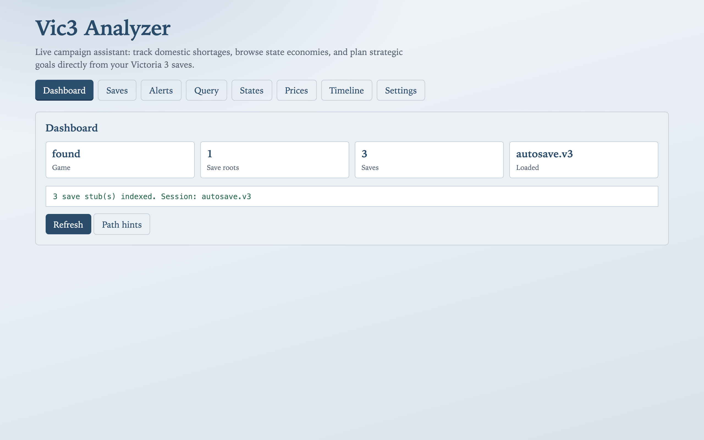
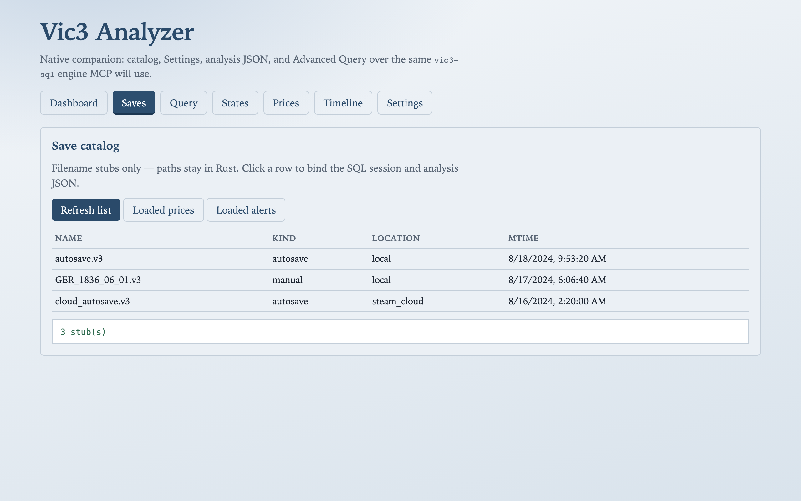
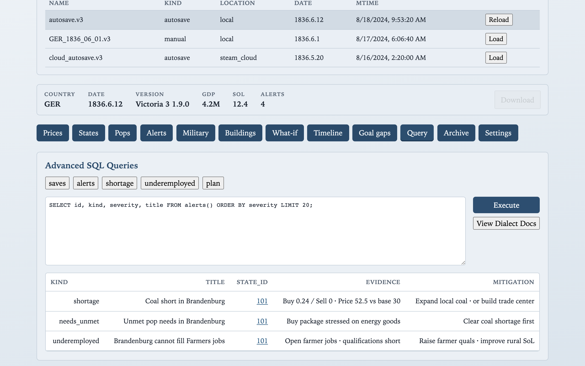
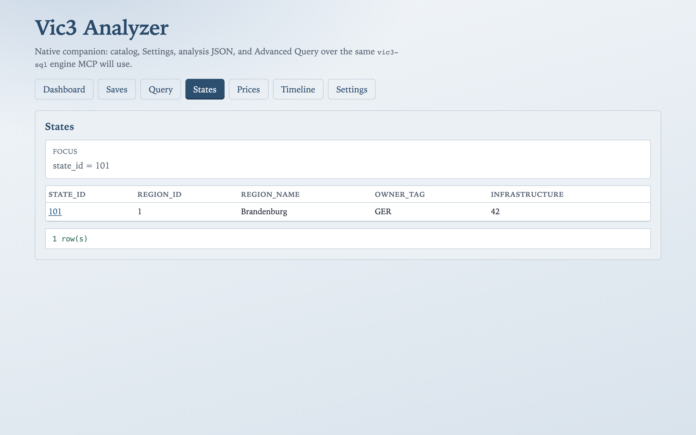
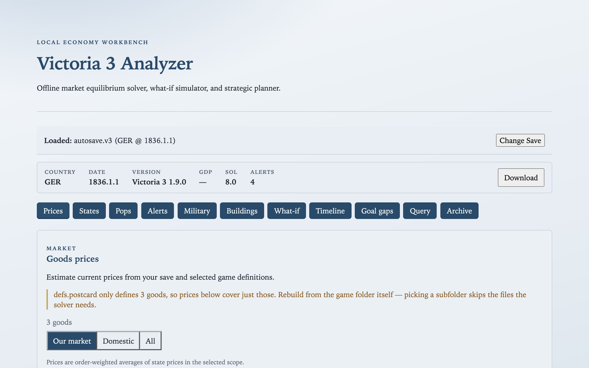
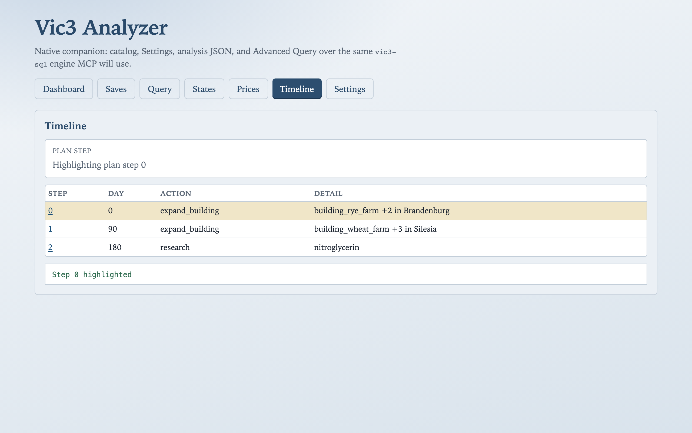
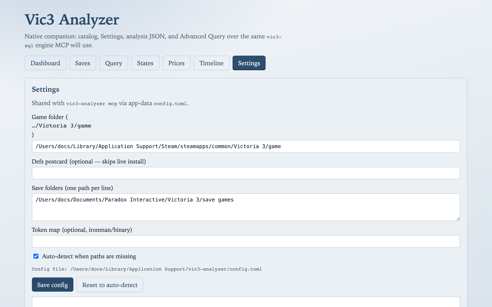

# Desktop companion

Play Vic3, alt-tab to a shell that already sees your autosaves. The native companion finds Steam/Paradox paths, binds a save by stub name, runs SQL on the loaded stub, then opens Timeline for a sequenced plan.

Building-level **what-if** UI lives on the [web](web.md) workbench and via MCP `preview_delta`. The companion answers the same *questions* through **Advanced Query** and **Timeline** today.

## What you get

| Pane | Player payoff |
| --- | --- |
| **Dashboard** | Save count, loaded stub, defs OK — “it found your campaign” |
| **Saves** | Catalog of local / cloud stubs; load prices and alerts without hunting folders |
| **Advanced Query** | Same SQL dialect as MCP `query` — shortages, alerts, constructions, `plan` / `gaps` |
| **States / Prices** | Click `state_id` or `good` in results to drill down |
| **Timeline** | Time-ordered actions from `plan(...)` (GDP path, research, …) |
| **Settings** | Game folder, save roots, tokens — privacy stays local |

One fat binary: default argv opens the GUI; `vic3-analyzer mcp` runs the stdio MCP server with no window. Install and config details: [desktop.md](../desktop.md) (technical).





## Advanced Query recipes

Open **Advanced Query**, bind a stub from Saves (or use `latest` selectors per [sql.md](../sql.md)), then paste. Short table names are already **player-scoped**.

### Shortages by state

```sql
SELECT s.region_name, g.good, g.shortage, g.price
FROM states s
JOIN goods_by_state g USING (state_id)
WHERE g.shortage > 0
ORDER BY g.shortage DESC
LIMIT 20;
```



Click a `state_id` to jump to States; click a good to focus Prices.





### Alert triage

```sql
SELECT kind, severity, count(*) AS n
FROM alerts()
GROUP BY kind, severity
ORDER BY severity, n DESC;

SELECT id, kind, title, good_id, state_id
FROM alerts()
WHERE severity = 1
LIMIT 40;

-- Mitigations only after you shortlist an id (avoid SELECT * as the first step):
SELECT id, evidence, mitigations FROM alerts() WHERE id = 'goods:engines';

SELECT good, alert_id, kind, shortage, price
FROM shortage_analysis('engines');
```

### Construction queue

```sql
SELECT queue, position, building, building_name, remaining
FROM constructions
ORDER BY queue, position
LIMIT 40;
```

Useful when iron, wood, or tools are short and you want to see what you already queued.

### Goal plans and gaps

**Grow GDP** — produces a Timeline when the planner finds building-expansion steps:

```sql
SELECT step, day, action, detail
FROM plan('gdp >= 100000000')
ORDER BY step;
```

**Prepare for war** — often start with gaps. A [diplomatic play](https://vic3.paradoxwikis.com/Diplomatic_play) needs interest, staffed army power, munitions prices under control, and solvency — missing any of those blocks the play:

```sql
SELECT predicate, status, detail
FROM gaps('declare-war(state=alsace)');
```

**Rush a tech**:

```sql
SELECT step, day, action, detail
FROM plan('research(tech=nitroglycerin)')
ORDER BY step;
```

Goal language reference: [dsl.md](../dsl.md). Full dialect: [sql.md](../sql.md).

## Timeline

After a successful `plan(...)`, open **Timeline** for the same steps as the SQL result, in time order.



## Settings and privacy

Autosave and game paths stay on disk. Settings shows what auto-detect found; override only when Steam libraries live elsewhere.



> **What-if callout** — Instant “+5 mills, what moves?” lives on the [browser What-if](web.md#what-if) pane and MCP `preview_delta`. Use companion SQL for triage and Timeline/`plan` for sequenced goals.

## Technical reference

Config keys, discovery order, Tauri invokes: [docs/desktop.md](../desktop.md).

## Model notes

See [_model-notes.md](_model-notes.md).
