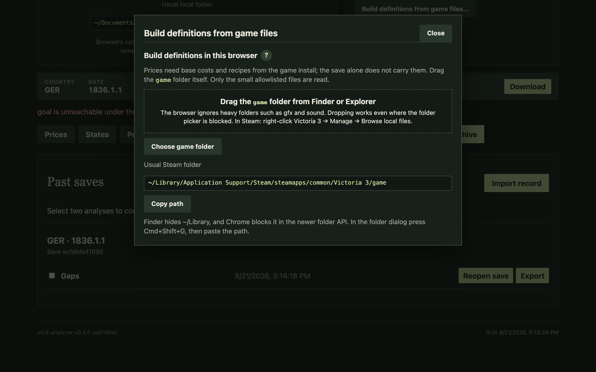
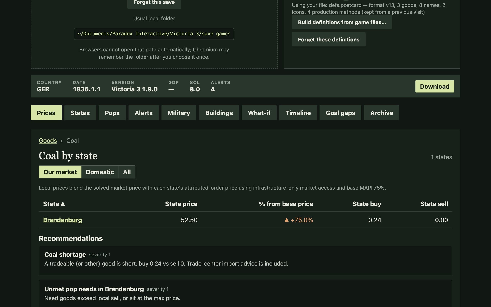
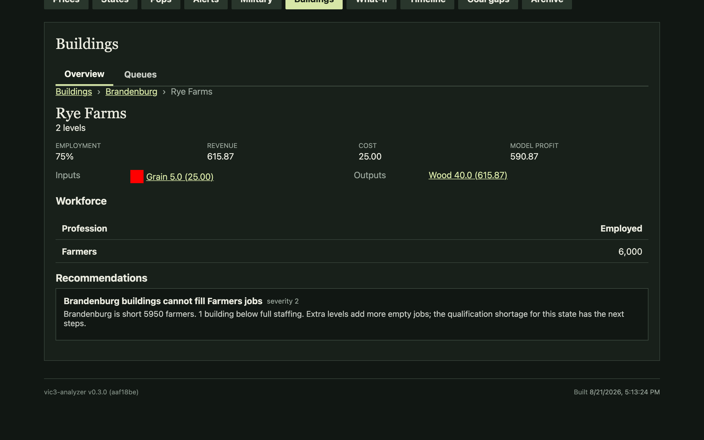
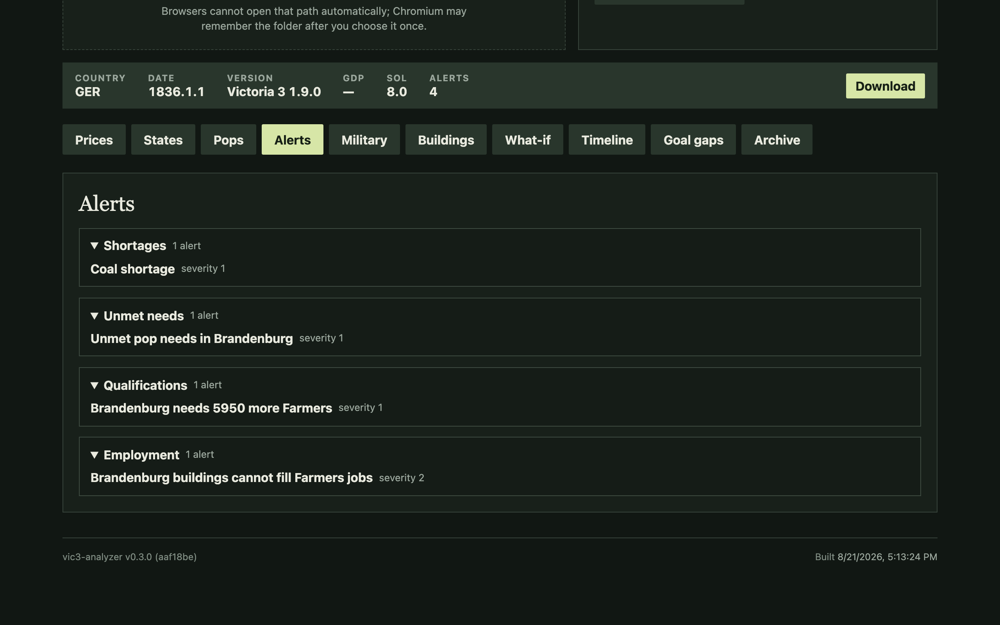
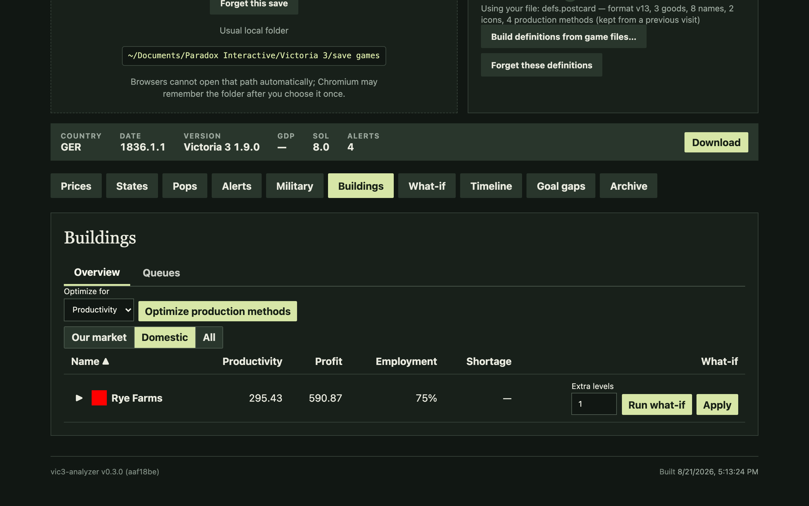
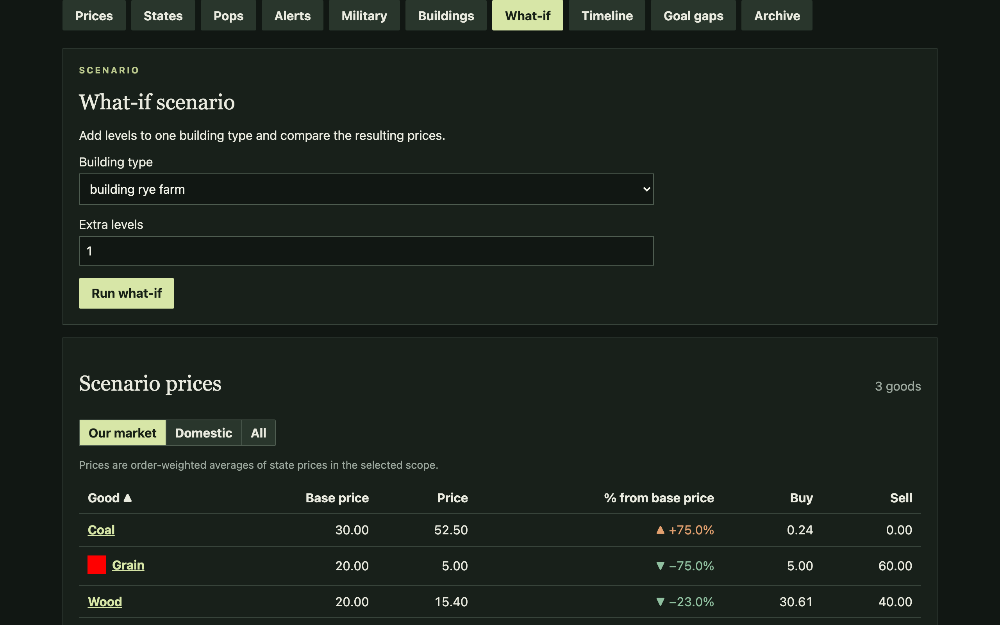
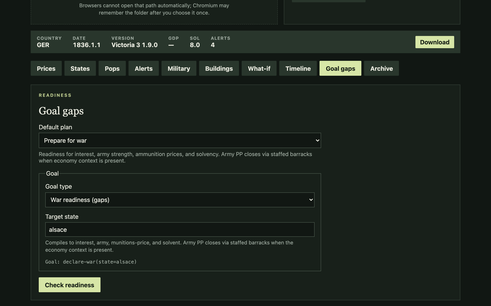
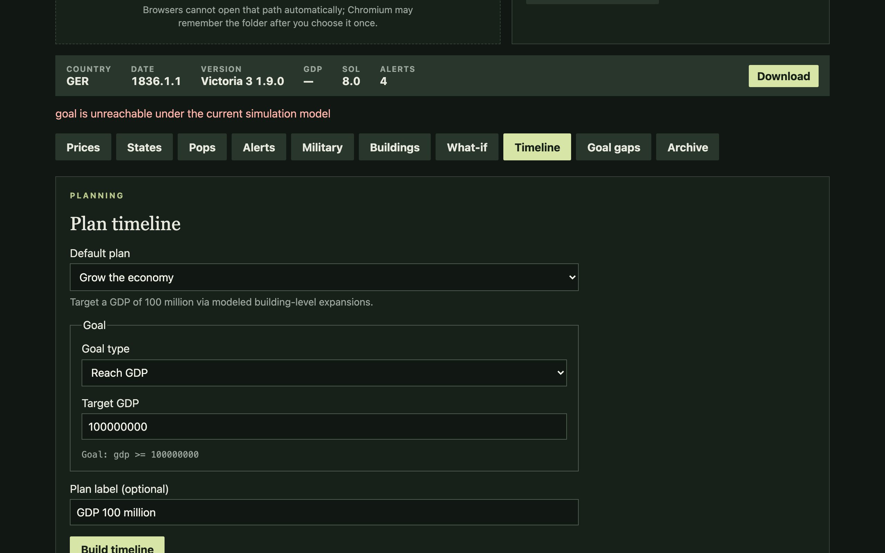
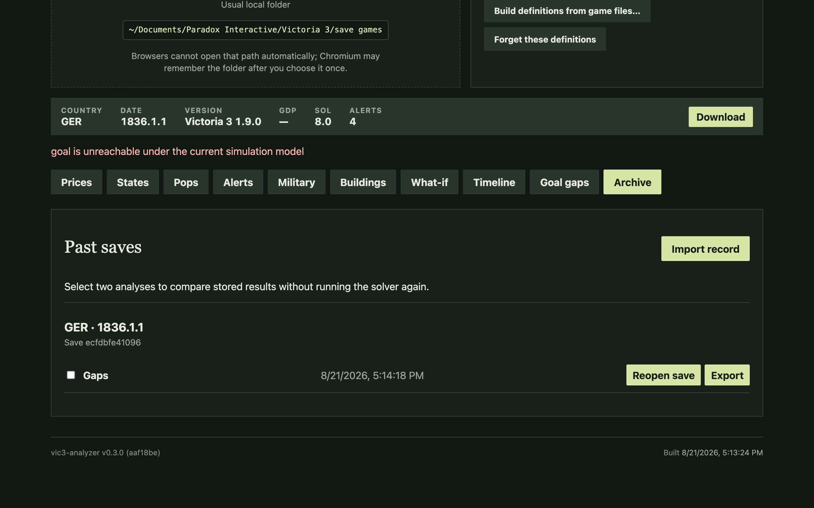

# Browser workbench

Drop a [Victoria 3](https://www.paradoxinteractive.com/games/victoria-3/about) save in the browser — **nothing uploads**. Load a save, inspect prices, run a What-if on a build, then use Goal gaps or Timeline for war readiness and GDP paths. Mechanics below link to the [Victoria 3 Wiki](https://vic3.paradoxwikis.com/) on first use.

**Live demo:** [https://jmalicki.github.io/vic3-analyzer/](https://jmalicki.github.io/vic3-analyzer/)

## Why game definitions are required

The hosted site **ships no Victoria 3 definitions** (goods, buildings, production methods, localization, icons). That is intentional and legal, not a missing download:

- Paradox game data is **copyrighted**. We cannot redistribute `common/`, English loc, goods icons, or a prebuilt defs blob from the install.
- You point the app at **your own** `Victoria 3/game` folder (drag is the reliable path on macOS/Windows) or load a defs blob **you** built. Files are read **in the browser**, stored in IndexedDB, and **never uploaded**.
- Until defs are present, analysis stays disabled — otherwise the UI would silently price a tiny incomplete set and look broken or misleading.

Desktop and MCP can auto-detect Steam on disk; the web app cannot ship or fetch the install for you, so the same copyright boundary shows up as an explicit local pick.

Prefer plaintext saves: `"save_file_format": "zip_text_all"` in `pdx_settings.json`, then re-save. See [Save-game editing](https://vic3.paradoxwikis.com/Save-game_editing). Ironman stays binary and needs a token map you supply yourself — we do not redistribute maps.

## Load a save

With defs ready, open a `.v3` (or paste bytes). The workbench solves [market](https://vic3.paradoxwikis.com/Market) prices automatically and unlocks the panes below. Reloads restore the last save and defs from IndexedDB until you forget them.

## Prices

National overview with goods icons, prices vs base, and sort by the columns you care about.

Drill into a good for **state-attributed** buy/sell orders — where the [shortage](https://vic3.paradoxwikis.com/Market#Shortage) actually lives. Buildings and pops pay **local** prices: each state blends the national market price with what it would pay in isolation; that blend weight is [Market Access Price Impact (MAPI)](https://vic3.paradoxwikis.com/Market#Local_prices), scaled by [market access](https://vic3.paradoxwikis.com/Infrastructure#Market_access).

Open a building for model IO, costs, revenue, profit, and shortages on that site.

## States

Sortable domestic states with drill-down into infrastructure, employment, and **qualifications** stock vs jobs. This is the evidence for “why are my factories empty?” — peasants do not become [engineers](https://vic3.paradoxwikis.com/Profession) overnight; literacy and universities gate the pipeline.

## Pops

National pop view with needs and qualification drill-down. Use it with States when an LLM or your gut says “build more industry” but staffing says otherwise.

## Alerts

Read-only red flags from the same detectors as SQL `alerts()` — goods/[shortage](https://vic3.paradoxwikis.com/Market#Shortage) pressure, underemployment, and projected mitigations when available.

## Military

Army, navy, and mobilization snapshots from the save — useful before a [diplomatic play](https://vic3.paradoxwikis.com/Diplomatic_play) when you need power projection and interest context.

## Buildings

Domestic buildings, queues, and production-method context. Construction demand for wood/iron/tools is the classic bankruptcy loop; see the queue before you expand another [construction sector](https://vic3.paradoxwikis.com/Building#Construction_sector).

## What-if

Instant counterfactual on the **current** world: pick a building, add levels (or switch a PM where supported), re-solve, and read price/[shortage](https://vic3.paradoxwikis.com/Market#Shortage) deltas. This is the quick “should I queue this?” complement to multi-step plans.

Employment, wages, and trade stay frozen unless the delta changes them; pop demand still re-equilibrates in the price loop. Details in [Model notes](#model-notes).

## Plans and gaps

Vic3 goals are hard for the same reasons as the campaign: [qualifications](https://vic3.paradoxwikis.com/Profession#Qualifications) and universities, construction-goods loops, MAPI-local prices, and war readiness (interest, staffed army, munitions, solvency). Use two verbs deliberately:

| Verb | Meaning | Pane |
| --- | --- | --- |
| **What-if** | One delta on *now* | What-if |
| **Gaps / Timeline** | Goal readiness or a time-ordered path | Goal gaps / Timeline |

### Prepare for war → Goal gaps

Preset **Prepare for war** checks `declare-war(state=…)` readiness. War readiness is often a **checklist first**; Timeline runs only when the planner can act on what is still missing.

### Grow the economy → Timeline

Preset **Grow the economy** (`gdp >= 100000000`) searches modeled building expansions into a sequenced path — order matters when inputs and construction goods move together.

Also available: research / army power (Timeline when the planner has a path), avoid default (payday model when surplus can close), colonize and SoL / weekly income (**gaps-only** today). If a preset cannot close Timeline in the UI, treat it as gaps-only.

## Archive

Compare two solves or a what-if against baseline without exporting to Excel.

## Setup appendix

1. Open the defs builder; copy the usual Steam `…/Victoria 3/game` path for your OS if helpful.
2. **Drag** the `game` folder onto the card (native file dialogs often hide Steam locations).
3. Wait for the in-browser pack; check `defs_summary` goods counts — a blob under ~10 goods is fixture-sized or incomplete.
4. Load a plaintext save; analysis unlocks when both are present.
5. Use **Forget definitions** when switching installs or clearing a bad blob.

Developer build notes (wasm, Vitest): [web/README.md](../../web/README.md).

## Model notes

See [_model-notes.md](_model-notes.md).
